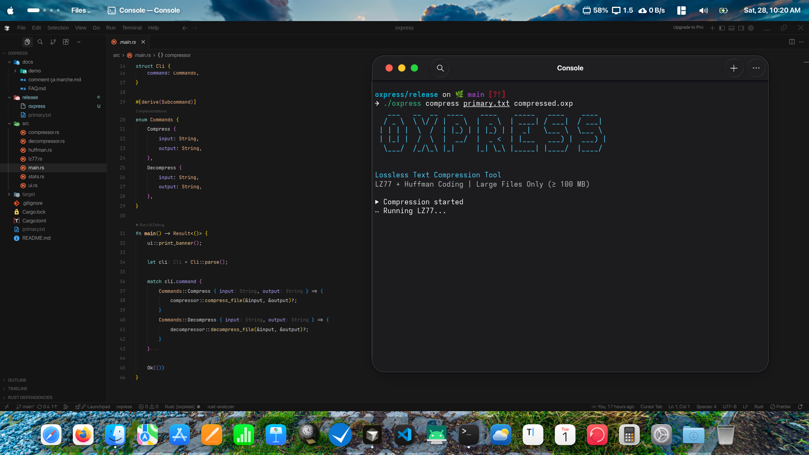
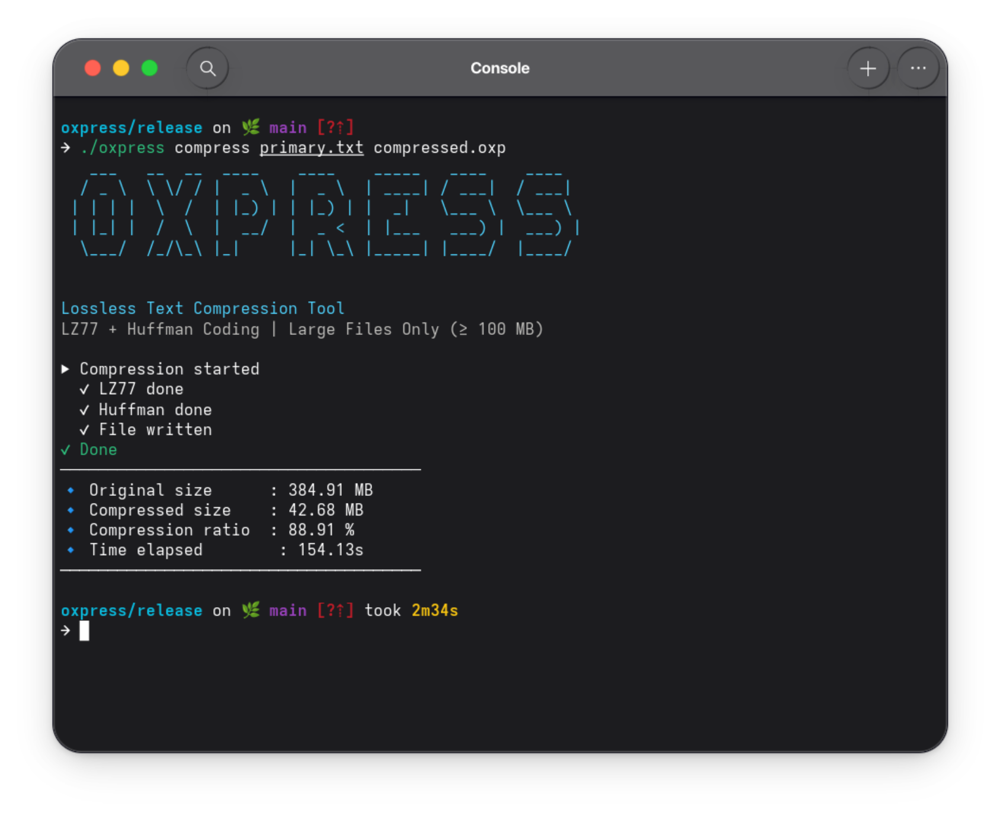
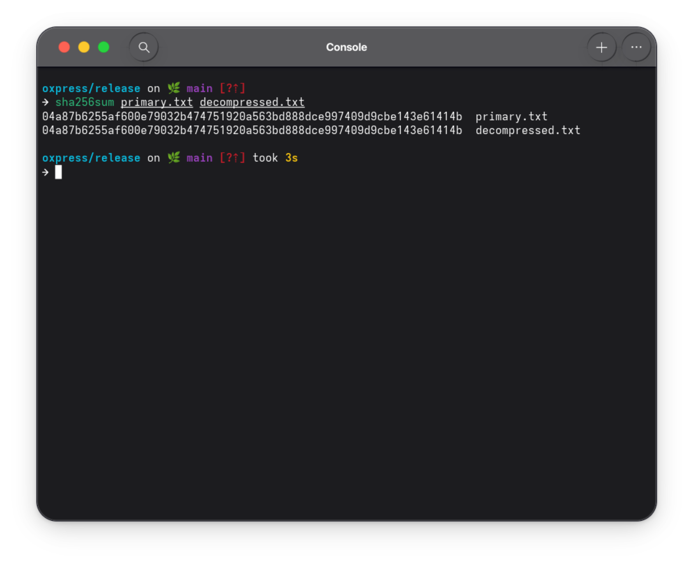

# 🦀 Oxpress

<div align="center">

  
  
  

  <br>

  <p>
    <b>Oxpress</b> est un compresseur sans perte (lossless) écrit en Rust
  </p>

</div>

Il implémente une architecture hybride combinant :

- **LZ77** pour détecter les répétitions
- **Huffman** pour réduire l’entropie
- Une CLI moderne basée sur `clap`
- Sécurité mémoire garantie par Rust

## Features Demo

#### Compression



#### décompression


#### Testing and verification



## Fonctionnalités disponibles

#### Pipeline de compression

```

[ Texte Brut ]
↓
[ LZ77 — Sliding Window ]
↓
[ Sérialisation des tokens ]
↓
[ Huffman — Encodage entropique ]
↓
[ Fichier compressé (.oxp) ]

```

#### LZ77 — Sliding Window

LZ77 détecte les répétitions dans une **fenêtre glissante (sliding window)**.

**Principes** :

- Une fenêtre regarde les données précédentes
- On recherche la plus longue correspondance
- On encode sous forme de :

```rust
pub struct Token {
    pub offset: u16,
    pub length: u16,
    pub next: u8,
}
```

_Chaque token représente_ :

- `offset` qui est la distance vers la répétition
- `length`, la longueur de la répétition
- `next`, le prochain octet littéral

Cette étape réduit les redondances structurelles.

#### Huffman — Encodage Entropique

**Après LZ77**:

1. Calcul des fréquences
2. Construction d’un arbre de Huffman
3. Génération d’un dictionnaire binaire
4. Encodage en bitstream compact

_Structures utilisées_ :

- `HashMap<u8, usize>`: fréquences
- `BinaryHeap` : construction de l’arbre
- `Vec<bool>` : représentation temporaire des bits
- Sérialisation via `bincode`

#### La décompression :

1. L’arbre de Huffman est reconstruit à partir des données stockées dans le header
2. Le flux est décodé
3. Les tokens LZ77 sont restaurés

#### Sécurité Mémoire

Oxpress bénéficie des garanties de Rust :

- Pas de buffer overflow
- Pas de data race
- Ownership strict
- Gestion d’erreurs explicite (`Result`, `anyhow`)
- Aucune utilisation de `unsafe`

Cela rend l’outil robuste même pour de gros fichiers.

## Fonctionnalités à venir

- [ ] Optimisation recherche LZ77 (table de hachage)
- [ ] Multi-threading avec `rayon`
- [ ] Streaming compression (fichiers > 1GB)
- [ ] Format binaire custom avec magic header
- [ ] Support de différents niveaux de compression

## Stack

- **Rust** comme langage de programmation
- **clap** pour le cli
- **bincode** pour le encoding binaire
- **colored** et **figlet-rs** pour le superbe UI experience

### Livrable

- Code source complet sur [ce repositorie](https://github.com/ranto-dev/LeaveFlow.git)
- Documentation pour l'utilisation de cette outil dans le fichier [`docs/comment ça marche.md`](./docs/comment%20ça%20marche.md)
- Explication de l'architecture et rapport sur le pojet: [`docs/FAQ.md`](./docs/FAQ.md)
