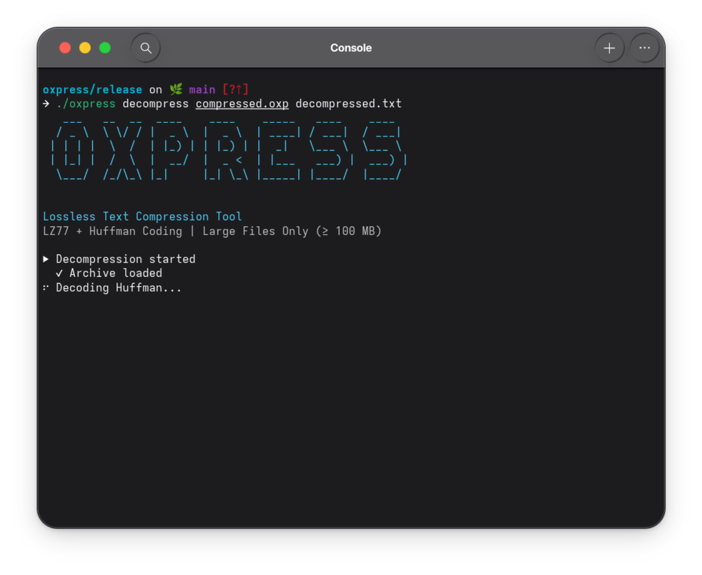

# Documentation d'installation et d'utilisation

**Comment ça marche?**

## 1. Environement

Pour que ce projet puisse marché sur votre machine, il est **nécessaire** que vous ayez un système d'exploitation **Linux** ou **MacOS**

_NB_: On n'a pas pu tester ce programme avec d'autre système d'exploitation comme **Windows**

## 2. Cloner le repositorie github

Avant, il est **nécessaire** qu'on a une version de `git` installé sur notre machine

```bash
# afficher la version de git sur notre terminal ou CMD
git --version
```

Ensuite on effectue la commande suivante pour cloner le projet

- si on utilise une `ssh`

  ```bash
  git clone git@github.com:ranto-dev/oxpress.git
  ```

- sinon, on peut le cloner directement en utilisant le protocole `https`

  ```bash
  git clone https://github.com/ranto-dev/oxpress.git
  ```

## 3. Utilisation

Dans le répertoire **release**, vous trouverez un fichier executable nommé [**oxpress**](../release/oxpress). Pour la suite, vous pouver suivre les commandes suivante:

```bash
# affichier le guide d'utilisation du cli
./oxpress --help

# pour compresser du fichier texte
./oxpress compress <input.txt> <output.oxp>

# pour restaurer et décompresser un fichier texte depuis un fichier *.oxp
./oxpress decompress <input.oxp> <output.txt>

# pour tester la conformité entre le fichier texte primaire et le fichier apres décompression
sha256sum <primary.txt> <decompressed.txt> # les deux hash doivent etre identique
```

Si on veut tester directement le projet avec `cargo` et rebuild ou lancer le projet en mode debug alors il est primordiale d'[**installer rust**](https://rust-lang.org/fr/) sur votre machine.

```bash
# verification de l'installation de rust
rustup --version
rustc --versiom
cargo --version

# aller dans le dossier du projet
cd oxpress

# build une nouvelle version d'oxpress
cargo build --release

## lancer le fichier executable produite
target/release/oxpress --help
```

### 4. Demo

#### Compression


#### décompression



#### Testing and verification


